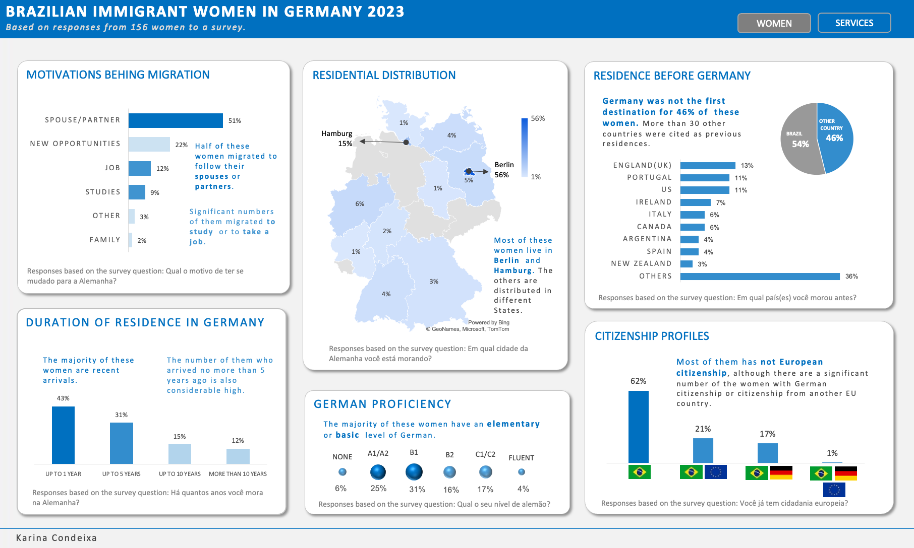
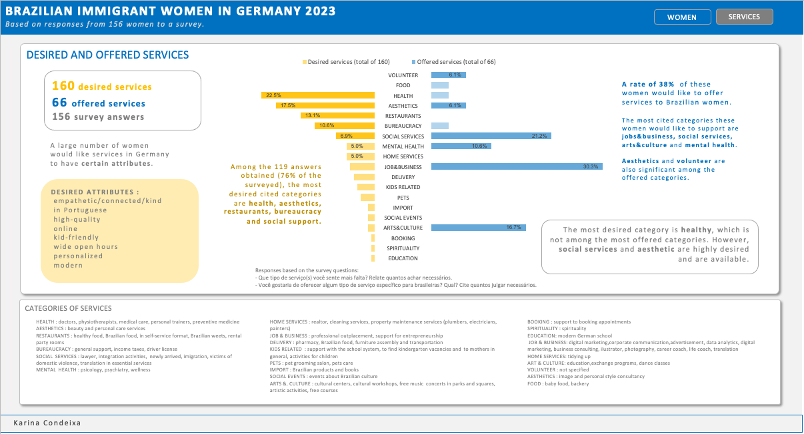

# Brazilian immigrant women in Germany
Descriptive analysis and data visualization about Brazilian women in Germany, classification of services desired and offered, in cooperation with Ligia Fascioni (UX design).

### The dataset
The dataset come up from a close reading and classification of 156 answers from a survey with 14 questions done using Google form and spread out by posts in LinkedIn, messages in Whatsapp groups and from organizations of related work between 3/12/2024 and 12/12/2024.

### Objectives
We wanted to find out whether the services offered by these women could meet any demand for the desired services. Therefore, we assessed the profile of these women, as well as desired and offered services.

It is a descriptive analysis considering only the sample of 156 people. We are aware that this sample tends to be biased, as some groups that responded to the survey were specific to women in the IT sector. Therefore, a wider survey could avoid bias.

### Data manipulation
- data cleaning
- data wrangling
- data classification
- data visulization and dasboards

### Challenges
The data classification was challenging, mainly in the services. The question were open to the people fill with natural text being allowed to keep blank or to write a long text. Thus, several people cited different services, but also told stories and used this space to vent. It also opened a room to have answer for previous questions in the wrong cell; I disregarded these answers in this analysis. Thus, a manual classification was needed.

### Tools used
- Google sheets and Google docs
- Excel
- Python, Pandas, Jupyter Notebook

Although Python and Pandas were also used to do cleaning, Excel was demonstred to be faster because the dataset is small.
The data visualization and dashboards were done using Excel.
Google sheets and Google docs were used to document and share the development of the analysis with tthe team.

---------------
### Links

[responses](https://docs.google.com/spreadsheets/d/1BWJpRJAhvpp_h46c2O1IVsDSzFk4MRmAwAhakDS03qM/edit#gid=1398339930
)

[bwig_results](https://docs.google.com/spreadsheets/d/1HAYNOSpPkHpyG4KoHGMbrcd8osPaD_4i3w7cj-Nkv1o/edit#gid=0)

[documentation](https://docs.google.com/document/d/1pFPFwXSsGyhxW1wD-hsiCPkFhFufJkmlv09mXLt09OA/edit)

[bwig.ipynb](https://colab.research.google.com/drive/12-I1FXsvzliWlKIhXba_P5AtBTWcsT9M#scrollTo=d2_iLj6ZuZNN)

[cleaned_df1.ipynb](https://colab.research.google.com/drive/12-I1FXsvzliWlKIhXba_P5AtBTWcsT9M#scrollTo=d2_iLj6ZuZNN)

[services.ipynb](https://colab.research.google.com/drive/1ND7iiAmNBWITSli_cwyOgZQDk7Z9mj6D#scrollTo=kl1BHEFgiaHa)

Descriptive analysis about Brazilian women immigrants in Germany, classification of services desired and  offered.
